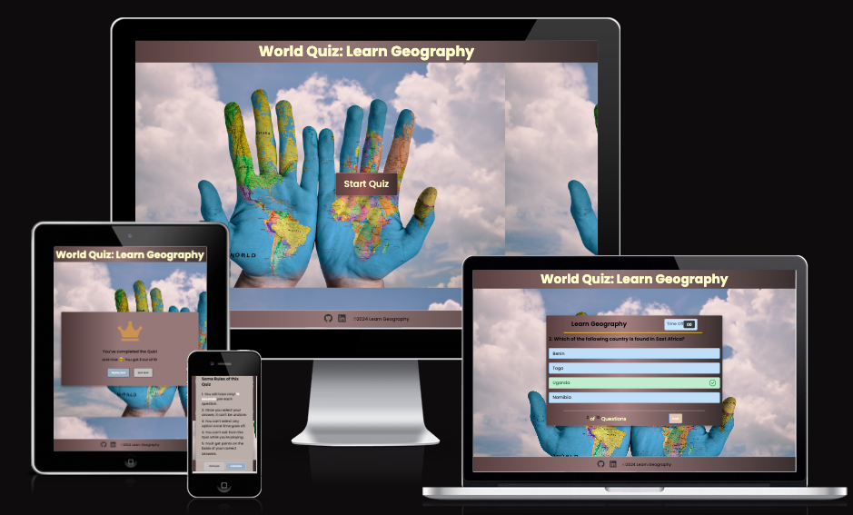

# World Quiz: Learn Geography

Welcome to the Quiz App! 
This interactive quiz application allows users to test their knowledge on various topics with a set of questions and options.

[Link to the Live wetbsite](https://joannaadermark1.github.io/TheGeographyQuizApp/)

## Table of Contents

- [Overview](#overview)
- [Features](#features)
- [Interactive Interface](#Interactive-Interface)
- [How to Use](#how-to-use)
- [Technologies Used](#technologies-used)
- [Contributing](#contributing)
- [License](#license)

## Overview

This project implements a quiz application with a user-friendly interface. Users can start the quiz, answer multiple-choice questions, and see their final score. The design is responsive, making it suitable for various devices.

## Features

- Engaging quiz questions with multiple-choice options.
- Interactive timer to add a time challenge.
- Real-time feedback on correct and incorrect answers.
- Results page with a summary of the user's performance.
- Responsive design for a seamless experience across devices.

## Interactive User Interface:

 A smooth and user-friendly interface that provides instant feedback.
### Timer Functionality: 
Race against the clock! Each question has a timer to up the ante.
### Dynamic Question Set:
 A range of questions from various categories.
### Instant Result: 
Get your score as soon as you finish the quiz.

 ## Usage 
 How to Use
Click on the "Start Quiz" button to begin the quiz.
Answer the multiple-choice questions within the given time.
Receive immediate feedback on your answers.
View your final score and a summary of your performance.

### Info box
 . a box that shows the rules of the game will show up after clicking on the start bnt.
 

### Answering Questions:

. Each question has four multiple-choice options.
Click on your chosen answer.
. After selecting an answer, a next button appears allowing you to move to the next question.

### Timer: 
. Each question has a timer. If the time runs out before you select an answer, the correct answer is highlighted.

### End of Quiz:
. Once you've answered all questions, your score is shown.
. Depending on your score, a message of congratulations, encouragement, or consolation is displayed.

### Restart or Exiting:
. After viewing your score,you have the option to either restart the quiz or exit.
. The restart option allows you to try the quiz again.
. The exit option reloads the page, bringing you back to the start screen.

### Questions Array
. The questions for the quiz are stored in an array named questions. Each question is an object with the following properties:
numb: The number of the question.
. question: The actual question text.
. answer: The correct answer to the question.
. options: An array of four possible answers.
. To add more questions, expand the questions array by adding more question objects.

Styling and Appearance
. This code mainly provides the functional logic for the quiz application. For an improved user experience, consider adding CSS for styling and enhancing the appearance.

### Testing
. I tested playing thus game quiz in different browsers chrome,firefox,safari and i confirm that the results are correct.
. I confirmed that the colors and fonts ae easy to read.

## Technologies Used
HTML
CSS
JavaScript

### Validator Testing
. HTML
   . No errors showed when passing through the official W3C validator
. CSS 
   . No errors showed when passing through the jigsaw.w3c official validator
   
   
   
## Responsiveness
The site is designed and developed methodology ensures an adjusts of the layout, images, and elements As the screen gets larger, it can adjusts too.

## Lighthouse
Lighthouse Score for Desktop:

## Lighthouse
Lighthouse Score for mobile:

## Deployment
The website was build in VScode and deployed to Github 
by creating Pages using following steps:

Steps:Initialize a Git repository 

.Open project in VSCode.

.Open the terminal (View -> Terminal).

.Navigate to the project's root directory.

.Run: git init

.git add .

.git commit -m "added commit message here"

.Created a new repository on GitHub:

.Copy the URL of your newly created GitHub repository.

.Go back to VSCode's terminal.

.Link the local repo to the GitHub repo: git remote add origin YOUR_GITHUB_REPOSITORY_URL

.Push the code to GitHub:

.Push code: git push -u origin main

 ##Fixing bugs

# Credits
.The website background is from https://www.istockphoto.com/se

.Basic structure and understanding about quiz website taken from:https://www.youtube.com/watch?v=riDzcEQbX6k&t=2s
https://www.youtube.com/watch?v=WiLTsxjCmWQ&t=591s  
Kevin Powell videos

.Javascript understanding from CI challenges and start btn, timer, resultbtn understood and taken from youtuber @CodingNepal. https://www.youtube.com/watch?v=WUBhpSRS_fk

## Acknowledgements
Would like thank my fellew code institute students: Femi Ashiru for all the support i got from you with my project, Stjepan.Mesaros, Anjalee.kulasinghe, Gayatri.Ghogare Code Institute tutors.
my mentor Jubril.Akolade for encouraging me to keep pushing when i feel down.
I thank my husband Alexander Adermark and last but not least Thank you Slack Community for the suport mostly Kera.Hackteam you are always there with answers when there are questions and doubts.
